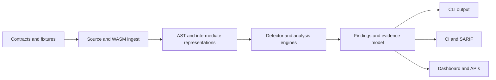

# Sentinel Forge

Advanced security, verification, and exploit analysis infrastructure for Soroban smart contracts.

[Architecture](docs/architecture/overview.md) · [Roadmap](ROADMAP.md) · [Contributing](CONTRIBUTING.md) · [Security](SECURITY.md)

## Overview

Sentinel Forge is a modular security platform for Soroban development. The project is designed to grow from a credible static analysis baseline into a broader verification stack that includes fuzzing, symbolic execution, exploit replay, and evidence-rich reporting.

The immediate goal is practical: make Soroban security work easier to understand, automate, and integrate into developer workflows before contracts reach production.

## Why it exists

Soroban still has a relatively thin security tooling layer compared with more mature smart contract ecosystems. That creates three recurring problems:

- teams rely too heavily on manual review
- smaller projects struggle to afford deep audit coverage
- developers lack reusable tooling for authorization analysis, state safety, and execution-level reasoning

Sentinel Forge exists to close that gap with contributor-friendly, open infrastructure.

## Current state

The repository currently includes working project foundations and a documented architecture surface:

- `apps/landing`: public-facing project site built with Next.js
- `apps/dashboard`: phase 4 security dashboard for findings, scan history, and code-linked trace review
- `apps/exploit-lab`: attack-path and replay-oriented exploit visualization prototype
- `engines/static-analyzer`: Rust-based Soroban analyzer with a real CLI, detector registry, and structured reporting
- `engines/fuzzer`, `engines/symbolic-executor`, `engines/verification-engine`: staged engine crates
- `extensions/vscode`: inline diagnostics scaffold for editor-native workflow integration
- `docs/`: architecture, security, research, and contributor guides
- `examples/`: space for vulnerable and secure contract fixtures

Phase 5 turns that analyzer and tooling foundation into a contributor-ready repository. The engine still parses Rust source with `syn`, builds a normalized IR, and runs built-in detectors, while the repo now adds stronger onboarding docs, issue and PR templates, richer fixture organization, and clearer extension paths for detector, reporter, and analyzer work.

## Capability map

| Capability | Status | Notes |
| --- | --- | --- |
| Landing page and project positioning | Active | Public explanation of modules, architecture, and roadmap |
| Static analyzer crate | MVP | Parses Rust contracts, walks an IR, and exposes `scan` and `ci` commands |
| Detector architecture | MVP | Built-in detector registry with authorization, storage, validation, arithmetic, DOS, and privilege rules |
| Reporting architecture | Phase 4 | Text, JSON, SARIF, and HTML output are implemented from one finding model |
| Dashboard | Phase 4 | Findings table, severity views, scan history, and trace-linked code context |
| Exploit visualization | Phase 4 | Attack path graph, replay timeline, and state transition prototype |
| VSCode integration scaffold | Phase 4 | CLI-backed diagnostics and hover-based remediation hints |
| Contributor infrastructure | Phase 5 | Issue templates, PR workflow, extension guides, and organized example suites |
| Fuzzing | Planned | Architecture and contributor guidance drafted |
| Symbolic execution | Planned | Path exploration design documented |
| Formal verification | Planned | Verification engine reserved in workspace |

## Architecture overview



The first implementation lane centers on static analysis because the phase 0 research identified authorization correctness, unsafe state access, arithmetic issues, and denial-of-service patterns as the highest-leverage initial detector classes.

See the deeper docs:

- [Analysis pipeline](docs/architecture/analysis-pipeline.md)
- [AST pipeline](docs/architecture/ast-pipeline.md)
- [WASM analysis](docs/architecture/wasm-analysis.md)
- [Plugin system](docs/architecture/plugin-system.md)
- [Reporting system](docs/architecture/reporting-system.md)

## Supported analysis types

Current emphasis:

- authorization flow analysis
- state access and mutation checks
- privilege escalation flows
- missing input validation
- arithmetic risk detection
- denial-of-service pattern detection

Planned expansion:

- WASM-aware inspection
- symbolic execution
- property-based fuzzing
- exploit simulation
- invariant verification

## Quick start

Install workspace dependencies:

```bash
corepack pnpm install
cargo build
```

Run the landing page:

```bash
corepack pnpm --filter @sentinel-forge/landing dev
```

Run the dashboard:

```bash
corepack pnpm --filter @sentinel-forge/dashboard dev
```

Run the exploit lab:

```bash
corepack pnpm --filter @sentinel-forge/exploit-lab dev
```

Run the analyzer against a contract:

```bash
cargo run -p static-analyzer --bin sentinel-forge -- scan examples/vulnerable-contracts/missing_authorization.rs
```

Export JSON:

```bash
cargo run -p static-analyzer --bin sentinel-forge -- scan examples/vulnerable-contracts/missing_authorization.rs --format json
```

Export HTML:

```bash
cargo run -p static-analyzer --bin sentinel-forge -- scan examples/vulnerable-contracts --format html --output reports/vulnerabilities.html
```

Use CI mode:

```bash
cargo run -p static-analyzer --bin sentinel-forge -- ci examples/secure-contracts/guarded_admin.rs
```

The workspace includes a local `pnpm` shim under `.bin/` so root Turborepo scripts still work when `pnpm` is not globally available.

## Repository structure

```text
apps/
  landing/
  dashboard/
  exploit-lab/
engines/
  static-analyzer/
  fuzzer/
  symbolic-executor/
  verification-engine/
packages/
  config/
  sdk/
  shared/
  ui/
docs/
  architecture/
  security/
  research/
  guides/
examples/
scripts/
```

## Developer workflow

Common commands:

```bash
corepack pnpm build
corepack pnpm test
cargo test
cargo run -p static-analyzer --bin sentinel-forge -- scan <path>
```

See [docs/guides/local-development.md](docs/guides/local-development.md) for a fuller setup and workflow guide.

## Documentation map

- [Architecture overview](docs/architecture/overview.md)
- [Threat model](docs/security/threat-model.md)
- [Detector guide](docs/guides/writing-detectors.md)
- [Analyzer guide](docs/guides/adding-analyzers.md)
- [Reporter guide](docs/guides/creating-reporters.md)
- [Engine extension guide](docs/guides/extending-engines.md)
- [Testing guide](docs/guides/testing-guide.md)
- [Phase 0 research summary](docs/research/phase-0-summary.md)
- [Contributor roadmap](docs/contributing/roadmap.md)
- [Issue taxonomy](docs/contributing/issue-taxonomy.md)
- [Review process](docs/contributing/review-process.md)

## Roadmap

The project is organized in phases:

- Phase 0: security research, scope definition, and MVP selection
- Phase 1: branding, monorepo infrastructure, landing page, and engine scaffolding
- Phase 2: documentation, architecture, threat modeling, and contributor guidance
- Phase 3: credible static analyzer MVP with built-in detectors and structured reporting
- Phase 4: visualization and tooling with dashboard, exploit-lab, HTML reporting, and IDE scaffolding
- Phase 5: contributor readiness with issue templates, extension guides, review standards, and benchmark or exploit fixtures

See [ROADMAP.md](ROADMAP.md) for the full phase breakdown.

## Security notice

Sentinel Forge is experimental security infrastructure. Findings and future scan results are intended to support human review, not replace formal audits or expert assessment.
