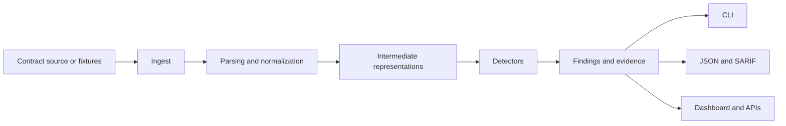

# Analysis Pipeline

This document describes the core pipeline Sentinel Forge is expected to use as the static analyzer grows from bootstrap to MVP.

## Design goals

- keep ingest separate from detector logic
- support both source-level and WASM-level analysis over time
- preserve a stable finding model for every output surface

## Pipeline shape

## Stages

### 1. Ingest

Accept local files, fixture directories, and eventually CI or API inputs. Ingest should resolve file metadata, normalize paths, and reject unsupported input forms early.

### 2. Parsing and normalization

Convert source code and later WASM modules into internal forms that detectors can use consistently. This stage should capture parser errors explicitly instead of silently dropping unsupported constructs.

### 3. Intermediate representations

Expected representations include:

- AST-level views for source structure
- control-flow and data-flow views for detector logic
- authorization and state-transition semantics
- future WASM instruction and host-call models

### 4. Detectors

Detectors should be small, single-purpose units that consume normalized context and produce findings with:

- severity
- confidence
- evidence
- remediation guidance

### 5. Findings and evidence

All user-facing surfaces should consume a common result model rather than bespoke output logic. This keeps CLI, CI, and UI behavior aligned.

## Current implementation note

The phase 3 MVP implements this pipeline in the static analyzer crate with:

- Rust source ingest for files and directories
- `syn`-based parsing and semantic extraction
- an intermediate representation for detector execution
- built-in text, JSON, and SARIF reporting
