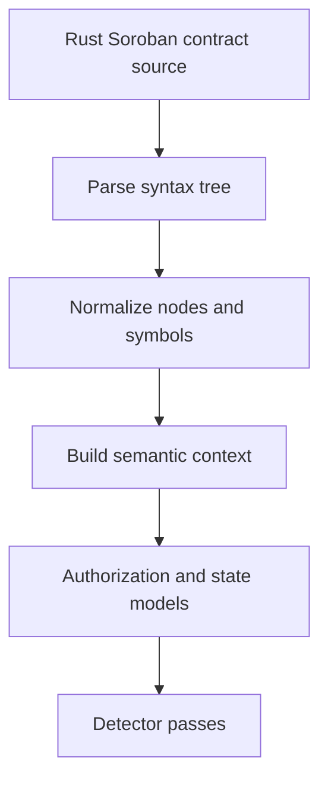

# AST Pipeline

The AST pipeline is the first deep analysis lane because it offers the fastest path from Soroban source code to useful detector output.

## Flow

## Responsibilities

### Parse syntax tree

Build a faithful source-level representation and preserve file and span information for reporting.

### Normalize nodes and symbols

Reduce parser-specific complexity into structures detectors can use without knowing source syntax details.

### Build semantic context

Track:

- functions and entrypoints
- storage reads and writes
- signer and authorization checks
- invariants and validation branches

### Detector passes

Initial passes should bias toward Soroban-relevant issues:

- missing or incomplete authorization checks
- unsafe storage access
- state transitions without validation guards
- arithmetic operations that need stronger safety reasoning

## Why AST first

Phase 0 research indicates that many high-value Soroban findings can be detected before symbolic execution or fuzzing are ready. AST analysis gives Sentinel Forge a credible early path to usable results.
