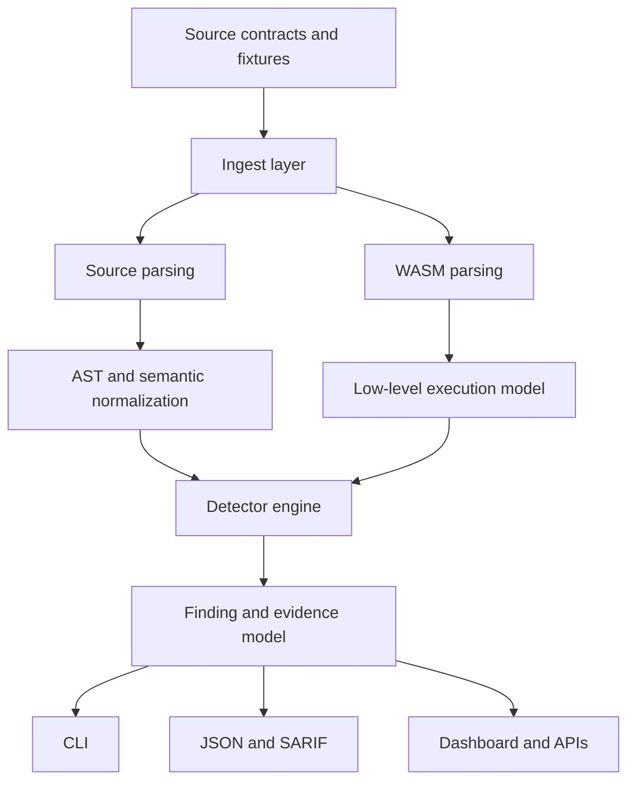

# Architecture Overview

Sentinel Forge is a hybrid monorepo that separates public product surfaces, Rust-based analysis engines, shared packages, and long-lived technical documentation.

## Architectural goals

- keep security logic modular enough to evolve from one engine into many
- preserve a stable finding model across CLI, CI, and future UI consumers
- document trust boundaries early because the platform will eventually inspect hostile code
- keep research, architecture, and implementation close enough that contributors can move between them without guessing

## Repository layers

| Layer | Purpose |
| --- | --- |
| `apps/landing` | Public explanation of the product, module map, and contributor posture |
| `apps/dashboard` | Future operational interface for findings, history, and traces |
| `apps/exploit-lab` | Future interactive attack replay and simulation surface |
| `engines/static-analyzer` | First implementation lane and CLI bootstrap |
| `engines/*` | Future fuzzing, symbolic execution, and verification systems |
| `packages/*` | Shared TypeScript config, UI primitives, SDK surfaces, and reusable types |
| `docs/*` | Architecture, research, security, and contributor guidance |

## High-level system flow

## Current implementation posture

Today, the codebase has:

- a Next.js landing page that explains the system and roadmap
- a Rust workspace with the static analyzer crate and placeholder engine crates
- contributor, research, and security documentation

The static analyzer is intentionally the first engine because phase 0 research pointed to authorization, state mutation, arithmetic, and denial-of-service checks as the most useful early detector set for Soroban.

## Architecture documents

- [Analysis pipeline](analysis-pipeline.md)
- [AST pipeline](ast-pipeline.md)
- [WASM analysis](wasm-analysis.md)
- [Symbolic execution](symbolic-execution.md)
- [Fuzzing architecture](fuzzing-architecture.md)
- [Plugin system](plugin-system.md)
- [Reporting system](reporting-system.md)
