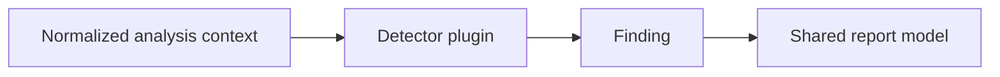

# Plugin System

Sentinel Forge should treat detectors and reporters as plugins around a shared analysis core. That keeps the platform extensible without forcing every capability into one crate or one output mode.

## Plugin categories

- detector plugins
- reporter plugins
- future ingest adapters

## Detector model

Detectors consume normalized analysis context and emit findings. They should not own parsing, CLI behavior, or export formatting.

## Reporter model

Reporters consume structured findings and translate them for specific consumers:

- human-readable CLI output
- JSON export
- SARIF for code scanning
- HTML or dashboard rendering

## Plugin standards

- single responsibility
- explicit metadata and supported scope
- stable interfaces
- deterministic tests
- documented blind spots

## Current interface shape

Phase 3 introduces a formal detector trait and registry in the static analyzer crate. The current implementation ships built-in detectors for:

- missing authorization
- unsafe storage access
- missing validation
- unchecked arithmetic
- denial-of-service patterns
- privilege escalation

Reporter plugins are still represented through the shared finding model and output renderers rather than a separate crate-level plugin API.
