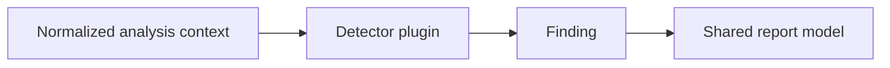

# Plugin System

Sentinel Forge should treat detectors and reporters as plugins around a shared analysis core. That keeps the platform extensible without forcing every capability into one crate or one output mode.

## Plugin categories

- detector plugins
- reporter plugins
- future ingest adapters

## Detector model

Detectors consume normalized analysis context and emit findings. They should not own parsing, CLI behavior, or export formatting.

## Reporter model

Reporters consume structured findings and translate them for specific consumers:

- human-readable CLI output
- JSON export
- SARIF for code scanning
- HTML or dashboard rendering

## Plugin standards

- single responsibility
- explicit metadata and supported scope
- stable interfaces
- deterministic tests
- documented blind spots

## Future interface shape

The current repository does not yet expose a formal trait-based plugin API beyond the documented direction. When phase 3 begins, detector and reporter traits should be introduced with the documentation in this file as the contract baseline.
