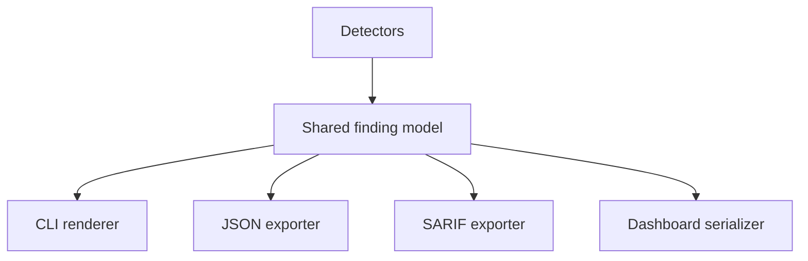

# Reporting System

A security tool is only as useful as the evidence it can deliver. Sentinel Forge should standardize on one finding model and project that into several output formats.

## Core finding fields

- identifier
- title
- severity
- confidence
- component or file location
- evidence
- remediation guidance
- detector provenance

## Reporting flow

## Output goals

### CLI

- readable during local development
- concise but evidence-backed

### JSON

- machine-readable
- stable enough for automation and future SDK consumers

### SARIF

- compatible with code-scanning workflows
- maps severity and location precisely

### Dashboard

- preserves report metadata
- supports grouping, filtering, and future history views

## Design rule

No renderer should need analysis-specific knowledge to operate. The analyzer produces findings; reporters only transform presentation.
