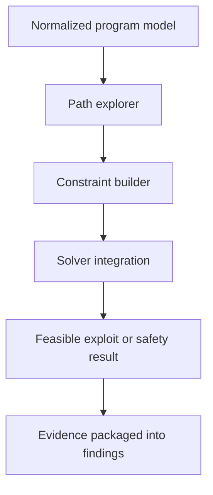

# Symbolic Execution Architecture

Symbolic execution is a later-phase engine for exploring paths that static checks cannot validate with enough confidence.

## Purpose

- reason about path-dependent behaviors
- discover exploit conditions hidden behind branching logic
- improve confidence for high-risk findings

## Planned flow

## Expected components

- path explorer
- branch and state tracker
- constraint builder
- solver adapter
- result minimizer for developer-readable evidence

## Output goals

Symbolic execution should not only say a path is feasible. It should explain:

- which branch conditions mattered
- what assumptions were required
- what state transitions became dangerous

That evidence should feed the same reporting model used by the static analyzer.
