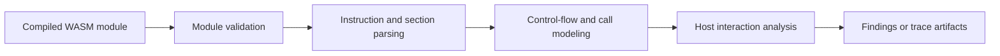

# WASM Analysis Architecture

Soroban contracts ultimately execute as WebAssembly modules. Sentinel Forge should eventually support a WASM-aware analysis lane so the platform is not limited to source-only reasoning.

## Objectives

- validate assumptions made at the source-analysis layer
- inspect low-level control flow and host interactions
- support future execution tracing, profiling, and symbolic reasoning

## Planned flow

## Areas of interest

- host function usage
- control-flow structure
- arithmetic and resource-heavy paths
- serialization and memory assumptions
- cross-checking source assumptions against compiled behavior

## Constraints

- WASM inspection should not assume trusted input
- malformed modules must fail safely
- parsing and modeling should be isolated from future execution components

## Relationship to other engines

WASM analysis strengthens:

- static analysis confidence
- symbolic execution path modeling
- exploit replay realism
- future gas and performance profiling
