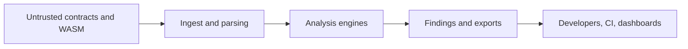

# Threat Model

Sentinel Forge is security infrastructure, so its trust model matters almost as much as its feature set. The project will eventually parse, model, and in some cases execute hostile artifacts. This document defines the major threat classes that shape the architecture.

## Assets to protect

- correctness and integrity of findings
- contributor and user trust in published reports
- local developer machines and CI runners
- example fixtures, research artifacts, and benchmark inputs
- future dashboard and API consumers

## Trust boundaries

Untrusted inputs should be assumed at the left side of the system. Findings, exports, and presentation layers inherit risk from everything that precedes them.

## Primary threat classes

### Analyzer bypass

Risk:

- unsupported language patterns
- incomplete parsing
- blind spots in authorization or state modeling

Impact:

- false negatives
- misplaced confidence in a clean report

Mitigations:

- document unsupported cases
- keep detectors narrow and testable
- add regression fixtures for every discovered bypass

### False assurance

Risk:

- overconfident severity labels
- findings without evidence
- unstated limits in analysis coverage

Impact:

- developers trust weak conclusions
- teams ship contracts with unresolved risk

Mitigations:

- attach confidence and evidence to findings
- include scope disclaimers in user-facing outputs
- distinguish bootstrap or heuristic checks from stronger guarantees

### Hostile input execution

Risk:

- malformed source or WASM
- exploit-lab samples
- future fuzzing and symbolic execution workloads

Impact:

- local crashes
- resource exhaustion
- sandbox escape if execution isolation is poor

Mitigations:

- sandbox hostile inputs
- cap CPU, memory, file, and network access
- separate parsing from execution where possible

### CI and supply-chain poisoning

Risk:

- malicious fixtures
- poisoned benchmark corpora
- unsafe helper scripts

Impact:

- corrupted results
- leaked secrets
- unstable automation

Mitigations:

- keep fixtures reviewable and deterministic
- avoid hidden network calls in tests
- prefer explicit, small test corpora

## Soroban-specific assumptions

- authorization logic is a top-tier security concern
- state transition safety matters as much as arithmetic correctness
- WASM-level inspection will become necessary for deeper coverage
- deterministic execution helps reproducibility but does not eliminate modeling errors

## Residual risk

Even with strong controls, Sentinel Forge can still miss bugs, mis-rank severity, or expose unsafe assumptions. The project should always communicate that it supports expert review rather than replacing it.
